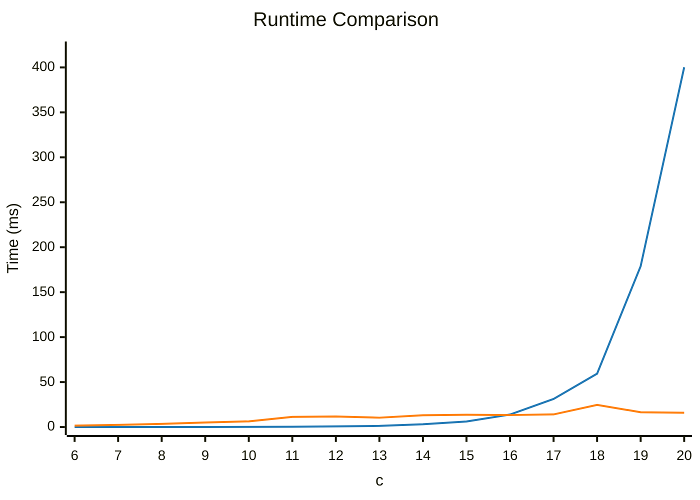

# Problem

Calculating of the energy of 1-D harmonic oscillator

Hamiltonian:
$$
\hat{H} = - \frac{1}{2} \frac{\mathrm{d}^2}{\mathrm{d}x^2} + \frac{1}{2}x^2
$$

Trial wave function:
$$
\psi(x) = \exp \left( -\frac{1}{2}x^2 \right)
$$

Energy:
$$
E = \frac{\langle \psi_0 | \hat{H} | \psi_0 \rangle}{\langle \psi_0 | \psi_0 \rangle} = \frac{1}{2}
$$

::right::

# Results

  

    ■ FDM
    ■ QTT+TCI
  

For $c = 16, n = 2^c = 65536$, 

- 0.4999999272383 ← FDM
- 0.4999999272384 ← QTT

